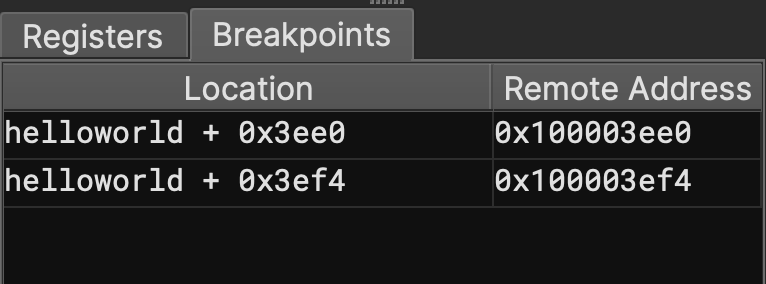
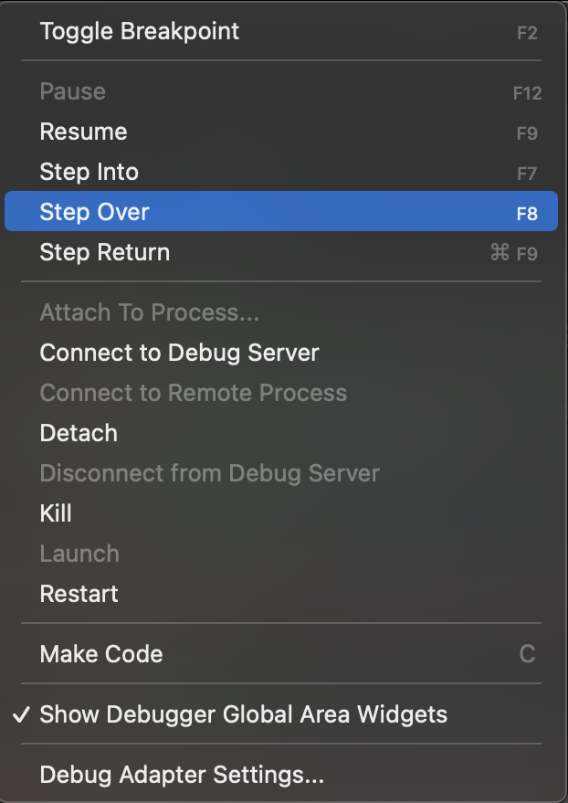
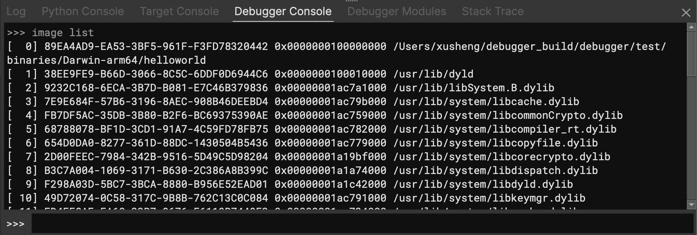

# Debugger

Binary Ninja Debugger is a plugin that can debug executables on Windows, Linux, and macOS, and more!

The debugger plugin is shipped with Binary Ninja. It is [open-source](https://github.com/Vector35/debugger) under an Apache License 2.0. Bug reports and pull requests are welcome!


## UI

[](../img/debugger/ui.png)

The debugger UI mainly consists of six parts:

- debugger sidebar
- debugger menu
- global area panels
- debugger status widget
- debugger context menu
- stack variable annotations


### Debugger Sidebar

Clicking the debugger sidebar button (along the left edge of the main window, the one that looks like a bug) will activate the debugger sidebar.

The debugger sidebar contains three widgets: the control buttons, the register widget, and the breakpoint widget.


#### Control Buttons


There is a row of buttons at the top of the debugger sidebar. They control the execution of the target. The behavior of each button is hopefully intuitive from its icon. You can also hover over the button to see the name of the icon.

Buttons that do not work for the current target status are disabled. For example: before launching the target, the `Step Into` button is disabled.

A common scenario is to click the left-most button to launch the target and then use the buttons on the right to resume the target, step into/over/return. The `Pause` button can be used to break into the target while it is running.

For `Step Into` and `Step Over`, if the current view is viewing an IL function, then the operation appears to be performed on that IL, offering a source-code debugging-like experience. However, the underlying operation is still performed at the disassembly level because that is the only thing the backend understands. The high-level operations are simulated, i.e., the debugger may decide to step the target multiple times before finally yielding the control. These are transparent to the users.


#### Register Widget


Register widget lists registers and their values. A hint column presents anything interesting pointed to by the register. Currently, only strings and pointers to strings are considered. In the future, we would also annotate variables.

Double-clicking a value enters editing mode, and the user can type in new values for the register. The new value is parsed as hex.

The register widget tracks the last seen value of registers and provides visual feedback. Unchanged values are colored white, changed values are colored blue. User-edited values are colored orange.

An experimental feature is added to shorten the list: registers with a value of zero are not shown in the list. To disable it temporarily, right-click and unselect "Hide Unused Registers". 


#### Breakpoint Widget



The breakpoint widget lists breakpoints in the target. There are two columns in it, the left one shows the address in the format of `module + offset`, and the right column shows the absolute address.

The context menu of the widget offers to delete a breakpoint or to jump to the address of a breakpoint.


### Debugger Menu

There is a `Debugger` menu in the main window menu bar.



It contains duplicates of the debugger control operations available via icons and also shows the hotkeys bound to those actions.

The `Launch/Connect Settings...` menu item will trigger a `Debug Adapter Settings` dialog:


Within this dialog, you can select which DebugAdapter to use, as well as configure debugger settings such as command-line arguments or the working directory.

`Run in Seperate Terminal` will cause the target to run in its own terminal, and the debugger will not be able to monitor its `stdout/stderr`, or send input `stdin`.
This is suitable when the target sends complex output, and the debugger's console emulator (which is quite basic now) cannot handle it.

### Global Area Panels

The debugger adds four new global area widgets: Target Console (terminal), Debugger Console, Stack Trace, and the Modules List.

#### Target Console


The `Target Console` panel simulates a terminal for the target. If the process writes to stdout, the content will be printed here. There is an input box at the bottom, and anything entered into it will be sent to the target's stdin.

Due to a backend limitation, this feature only works on macOS and Linux.  On Windows, the target always runs in its own external terminal and all input/output happens there.

On macOS and Linux, the default setting redirects the stdin/stdout here. However, if the user configures the target to run in its terminal (by calling `dbg.request_terminal_emulator = True`), then the stdin/stdout will not be redirected, and need to be accessed in the target's terminal.

#### Debugger Console



The debugger console allows the user to execute backend commands and get the result.

On Linux and macOS, the backend is based on LLDB and the console accepts LLDB commands.

On Windows, the backend is based on Windows Debugger Engine, and it supports WinDbg command syntax. All WinDbg extension command, e.g., `!peb` are also supported.

The console supports resuming the target, e.g., stepping.

#### Stack Trace


The stack trace widget lists all the threads along with the stack frames of the active thread.

The dropdown menu is a thread selector, which can be used to switch between threads. The selected thread will become the active thread and its stack frames will be shown below.

Double-clicking an item in the stack frames list navigates to the return address of the frame.


#### Module Widget


The module widget shows the address, size, name, and path information of the target's modules.

Note: the bizarrely huge size is caused by dyld_shared_cache on macOS, which will be addressed in the future. The size of the main executable is still calculated correctly.


### Debugger Status Widget


A debugger status widget is added to the main window's status bar. It indicates the current status of the target.

For example, when the target stops, it will include the reason for the stop. When the target exits, the exit code is reported. When an error occurs during certain operations, an error message will also be displayed here.

The widget shows the status of the debugger for the current binary view if a debugging session is active.


### Context menu


The debugger registers a series of useful actions along with keyboard shortcuts. These shortcuts can be customized using Binary Ninja's keybindings support.

Among these actions, target control actions, e.g., `Run`/`Step Into` have the same effect as the control buttons in the sidebar.

`Toggle Breakpoint` adds a breakpoint at the current location if there is no breakpoint; otherwise, the existing breakpoint is removed.

`Run To Here` lets the target execute until the current line is hit.

`Make Code` is an experimental feature that displays the selected region as code. If the region is indeed code, the user can use `P` to create a function there.

### Stack Variable Annotation


When the target breaks and a stack trace is available, the debugger annotates the stack variables in the linear view as data variables.

The above image shows the annotated stack with three stack frames. The start and end of each stack frame are marked, and stack variables are defined according to the stack variables in the functions.

To view the stack variable annotations, switch to the linear view of the Debugger binary view, and then navigate to the stack pointer address (such as by double-clicking the stack pointer in the Registers view).

A useful setup is a split view that shows the code on the left, and the stack on the right. If the user adopts this layout, remember to put the linear view that shows the stack region on a different sync group, so executing the target would not lead to navigation of the linear view. This way, we can observe how variables on the stack change.

In the future, we will offer a way to set up this side-by-side view in one click.

Only the stack frames and variables of the current (active) thread are annotated to avoid confusion. If you wish to view stack variables from a different thread, first switch to that thread in the `Stack Trace` global area panel.

The annotation is done only when there are at least two frames in the stack trace. This is a known limitation, and we will address it later.


### Other UI Elements

On every line that has a breakpoint, there are two visual indicators:

- the line is highlighted in red
- a red breakpoint tag is added to the left

On the line where the program counter is at, there are two visual indicators:

- the line is highlighted in blue
- a program counter tag (=>) is added to the left


## Design

### Debug Adapters

The goal of the Binary Ninja debugger is to provide a unified way of debugging programs on different platforms (e.g., Windows, Linux, macOS, etc). However, this is not an easy task, because each platform has its own way of supporting debugging and it varies considerably.

To deal with this, we abstract the core functionalities of a debugger into a class `DebugAdapter`. Each debug adapter is a subclass of the `DebugAdapter` with the platform-dependent implementation of each method.

The debugger then **drives** the various adapters, creating a unified debugging experience, both in GUI and API.

Right now, the debugger comes with two debug adapters. The `LLDBAdapter` uses [LLDB](https://lldb.llvm.org/) as its backend and debugs programs on macOS and Linux. The `DbgEngAdapter` uses [Windows debugger engine](https://docs.microsoft.com/en-us/windows-hardware/drivers/debugger/introduction), and debugs programs on Windows.

New debug adapters can be created by subclassing `DebugAdapter` to support other targets.

Remote debugging is a planned feature. Specifically, the capacity to connect to a target via [RSP protocol](https://sourceware.org/gdb/current/onlinedocs/gdb/Remote-Protocol.html) is already baked into the LLDBAdapter, though not tested.


### The Debugger BinaryView

To represent the memory space of the target, the debugger creates a specialized `BinaryView` called `DebugProcessView`. Throughout this document, it is also called the `Debugger` BinaryView.

[//]: # (On the other hand, there is a `base` BinaryView that is the BinaryView used to create the debugger. The base binaryView gets rebased to the correct location when the target launches. )

The Debugger BinaryView reads and writes its memory from the connected `DebugAdapter`. To save on data transfer, the debugger caches all read operations from the adapter. Whenever the debugger executes instructions or writes data, the cached data is cleared.

When the target is launched, the debugger automatically switches the view to the Debugger BinaryView.


The debugger automatically applies all analysis data to the Debugger BinaryView, including functions and types, etc. This means the user can conveniently use types that are present in the static analysis.

The Debugger BinaryView can be accessed by `dbg.live_view` once the target is launched. You can read/write to it in the normal way. Writing to it will also cause the target's memory to change.

Right now, the Debugger BinaryView is discarded once the target exits. It cannot be easily reused due to ASLR, which makes the base of the program different in each run. As a result, any changes the user made to the Debugger BinaryView will be discarded after the target exits.

## API

The debugger exposes its functionality in both the Python and C++ APIs. The Python documentation can be accessed [online](https://api.binary.ninja/binaryninja.debugger.debuggercontroller-module.html).

The API is centered around the [`DebuggerController`](https://api.binary.ninja/binaryninja.debugger.debuggercontroller-module.html#binaryninja.debugger.debuggercontroller.DebuggerController) class, which provides all functionalities of the debugger. There is no need to directly access the `DebugAdapter` classes.

When the debugger is used within the UI, the `dbg` magic variable is injected into the Python interpreter. It always represents the debugger for the currently active Binary View. You can think of it as being created by

```Python
dbg = DebuggerController(bv)
```

where `bv` is another magic variable that always represents the current BinaryView.

You can simply run `dbg.launch()` in the Python console to launch the target.


## How-to Guide

Here is an incomplete guide on how to get started with the debugger, covering most of the basics on operations in the debugger.


### Launch and Control the Target

There are several ways to launch the target:

- Use the control buttons at the top of the debugger sidebar
- Use the debugger main window menu
- Use the debugger context menu or its keybindings
- Run LLDB/WinDbg commands in the debugger console
- Run `dbg.go()`, `dbg.step_into()`, etc. in the Python console.

### Configure Launch Parameters

- Click "Debugger" -> "Launch/Connect Settings..." in the main window menu, and edit parameters in the dialog
- Directly set the value of `dbg.cmd_line`, `dbg.working_directory`, `dbg.working_dir`, etc


### Add/Remove Breakpoints

- Select the line, use the `Toggle Breakpoint` context menu
- Right-click a line in the Breakpoint widget in the sidebar, and select `Remove Breakpoint`
- Run `dbg.add_breakpoint(address)` or `dbg.delete_breakpoint(address)` in the Python console.


### Modify Register Values

- Double-click a value item in the Register widget, type in the new value, and hit enter
- Run `dbg.set_reg_value(reg_name, value)` in the Python console.


### View/Edit Memory

- Switch to Linear or hex view of the Debugger BinaryView, and view/edit in the normal way
- Get the Debugger BinaryView by `dbg.live_view`, and read/write it in the normal way


### Remote Debugging

See [Remote Debugging Guide](remote-debugging.md)


## Known Issues and Workarounds

There are some known issues and limitations with the current debugger.

Here is a list including potential workarounds.

### Administrative Access

Cannot debug binaries that require Administrator (Windows) or root (Linux/macOS). There are two ways to get around it:
    - On Windows, run Binary Ninja with Administrator privilege (not recommended).
    - Launch the process with necessary privilege, and connect to it using Binary Ninja debugger. See [Remote Debugging Guide](remote-debugging.md) for more details.
    - Must be an admin or in the \_developer group on macOS to debug.

### macOS

- Cannot debug fat binary on macOS. First launch the process using lldb-server/debugserver, and connect to it using Binary Ninja debugger. See [Remote Debugging Guide](remote-debugging.md) for more details.
- Cannot debug certain protected applications due to SIP (System Integrity Protection) on macOS. This includes applications in `/Applications`. While this can be circumvented by disabling the SIP, it will pose serious threat to the safety of you device. So we do not recommend it and you will need to proceed with it at your own risk.

## Troubleshooting

While we have tested the debugger in many scenarios, it may still malfunction in certain cases. Here are some basic steps to troubleshoot the situation.
If you encounter a bug, please file [an issue](https://github.com/Vector35/debugger/issues) with reproduction steps, and if possible, attach the binary involved.

1. If it crashes Binary Ninja, then it is always considered a bug.
2. If the debugger cannot launch the file properly, first check to make sure the file can be executed directly without a debugger.
3. Try to relaunch Binary Ninja and retry. There could be unintended side effects from previous debugging sessions. Whether it fixes the problem or not, please [file an issue](https://github.com/vector35/debugger/issues).
4. Try to use the LLDB/WinDbg binding that comes with Binary Ninja to debug the file directly. If LLDB/WinDbg can debug it properly, then it is a Binary Ninja issue. Otherwise, it is a bug in the LLDB/WinDbg itself. In both cases, please file an issue and let us know which case it is.
    The LLDB/WinDbg path can be found in the following path:
    - Windows, user installation: %APPDATA%\Binary Ninja\dbgeng\Windows Kits\10\Debuggers\x64\windbg.exe
    - Windows, system installation: %PROGRAMDATA%\Binary Ninja\dbgeng\Windows Kits\10\Debuggers\x64\windbg.exe
    - If the program you are debugging is x86, replace `x64` with `x86` in the above path.
    - Linux: [Binary Ninja Installation folder]/plugins/lldb/bin/lldb
    - macOS: /Applications/Binary Ninja.app/Contents/MacOS/plugins/lldb/bin/lldb


## Open-Source

Vector 35 is grateful for the following open source packages that are used in Binary Ninja debugger:

- [fmt](https://github.com/fmtlib/fmt) ([fmt license](https://github.com/fmtlib/fmt/blob/master/LICENSE.rst) - MIT)
- [pugixml](https://pugixml.org/) ([pugixml license](https://pugixml.org/license.html) - MIT)
- [gdb](https://www.gnu.org/software/gdb) ([GPLv3](https://www.gnu.org/licenses/gpl-3.0.html))
- [lldb](https://lldb.llvm.org/) ([Apache 2.0 License with LLVM exceptions](https://llvm.org/docs/DeveloperPolicy.html#new-llvm-project-license-framework))
